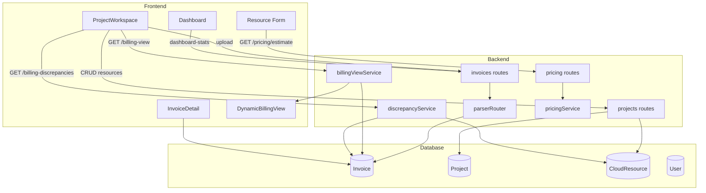

# Architecture Overview

## System purpose

AWS Billing Automation is a full-stack platform that connects **invoice ingestion**, **project-scoped infrastructure inventory**, and **dynamic billing views** into one workspace. Finance teams upload vendor bills; the system extracts structured data, associates invoices with projects, and renders billing spreadsheets from parsed metadata rather than hardcoded templates.

---

## High-level data flow



---

## Tech stack

| Layer | Technology |
|-------|------------|
| Frontend | React 18, TypeScript, Vite, Tailwind CSS, TanStack Query, Framer Motion |
| Backend | Node.js, Express, TypeScript |
| ORM / DB | Prisma → **PostgreSQL** |
| Auth | JWT (`authenticateToken` middleware) |
| OCR / AI | Gemini, GCP Document AI, AWS Textract, E2E/Jira parsers, pdf-parse fallback |
| Pricing | AWS instance catalog, Gemini estimate, heuristic fallback |
| FX | Frankfurter API (`exchangeRateService.ts`) |

---

## Application routes (frontend)

| Path | Component | Purpose |
|------|-----------|---------|
| `/dashboard` | `Dashboard.tsx` | KPIs, monthly chart, vendor chart, **month × project billing matrix** |
| `/projects` | `Projects.tsx` | Project list, create/edit workspace |
| `/projects/:id` | `ProjectWorkspace.tsx` | Overview, infrastructure, invoices, billing tabs |
| `/invoices` | `InvoiceList.tsx` | Billing ledger |
| `/invoices/:id` | `InvoiceDetail.tsx` | Review / edit extracted invoice (+ subscription seats) |

**Active routes:** `/dashboard`, `/projects`, `/projects/:id`, `/invoices`, `/invoices/:id`.

Navigation sidebar: **Dashboard** and **Projects** only.

---

## API surface (backend)

| Mount | Key endpoints |
|-------|---------------|
| `/api/auth` | Login, register, profile |
| `/api/invoices` | Upload, list, detail, update, delete, **`dashboard-stats`** |
| `/api/projects` | CRUD projects, resources, **billing-view**, **billing-discrepancies** |
| `/api/pricing` | `GET /estimate` — monthly cost lookup |
| `/api/exchange-rate` | Live INR/USD rate |

### Project & resource APIs

```
GET    /api/projects
GET    /api/projects/:id
POST   /api/projects
PUT    /api/projects/:id
DELETE /api/projects/:id

GET    /api/projects/:id/resources
POST   /api/projects/:id/resources
PUT    /api/projects/resources/:id
DELETE /api/projects/resources/:id

GET    /api/projects/:id/billing-view
GET    /api/projects/:id/billing-discrepancies
```

---

## Database schema (6 tables)

See [DATABASE.md](DATABASE.md) for full field reference.

```
User ──────────────< Invoice
Project ───────────< Invoice
Project ───────────< CloudResource
Invoice ───────────< InvoiceItem
Invoice ───────────< Attachment
```

### Entity summary

| Model | Role |
|-------|------|
| `User` | Auth, roles (ADMIN, FINANCE_MANAGER, EMPLOYEE, AUDITOR) |
| `Project` | Workspace: name, unique `code`, owner, billing provider |
| `CloudResource` | Infra / SaaS node: type, specs, **billingSeats**, **billingUnit**, monthly cost, env, region, tool |
| `Invoice` | Parsed bill: totals, status, `metadata` JSON, optional **environment** tag |
| `InvoiceItem` | Line items (also derived from `subscriptionLines` for SaaS) |
| `Attachment` | Uploaded file references |

Invoice detail fields (vendor address, GST, subscription lines, etc.) live in `Invoice.metadata` and are enriched at read time by `invoiceDetails.ts`.

---

## Core backend modules

| Module | File | Responsibility |
|--------|------|----------------|
| Parser router | `services/parserRouter.ts` | Routes upload to generic, E2E, or Jira parser |
| OCR | `services/ocrService.ts` | Cloud OCR + local PDF fallback |
| E2E parser | `services/e2eOcrService.ts` | E2E Networks invoice structure |
| Jira parser | `services/jiraOcrService.ts` | Subscription lines (product, seats, amount) |
| Billing view | `services/billingViewService.ts` | Dynamic grid; excludes FX metadata columns |
| Discrepancy | `services/discrepancyService.ts` | Invoice vs infrastructure scope matching |
| Pricing | `services/pricingService.ts` | AWS catalog → Gemini → heuristic |
| FX | `services/exchangeRateService.ts` | INR/USD with cache + fallback |
| Env filter | `utils/invoiceEnvironment.ts` | Invoice environment tagging & distinct envs |
| SaaS helpers | `utils/saasUtils.ts` | Subscription line → invoice items |

---

## Core frontend modules

| Module | File | Responsibility |
|--------|------|----------------|
| Project workspace | `pages/ProjectWorkspace.tsx` | Tabs + dynamic resource modal |
| Resource types | `constants/resourceTypes.ts` | Tool catalog + form profiles + SaaS billing models |
| Environment UX | `utils/environmentUtils.ts` | When to show env upload/filter UI |
| SaaS display | `utils/saasUtils.ts` | Seat formatting, subscription detection |
| Dynamic billing | `components/DynamicBillingView.tsx` | Renders `BillingView` from API |
| Discrepancy UI | `components/BillingDiscrepancyPanel.tsx` | Billing tab scope check |
| Tools / regions | `constants/tools.ts` | `TOOLS_LIST`, `ENVIRONMENTS`, `REGIONS` |

---

## Resource form profiles

Infrastructure add/edit forms use **profiles** from `constants/resourceTypes.ts`:

| Profile | Example services | Visible fields |
|---------|------------------|----------------|
| `compute` | EC2, VM, Droplet | Instance type, vCPU, RAM, storage, IP, region |
| `database` | RDS, Cloud SQL | DB class, storage, region |
| `storage` | S3, Blob | Tier, capacity, region |
| `serverless` | Lambda, Functions | Memory/tier, region |
| `usage` | SNS, SQS, ALB, Route53 | Name, cost, env, region |
| `saas` | Jira, Copilot | **Seat / usage / storage** models — see spec 08 |
| `container` | EKS, GKE | Cluster description, region |
| `generic` | Other / Custom | Optional spec text |

SaaS-specific: `needsPlanTier` and `saasBilling` (`seats` | `usage` | `storage`) on each catalog entry — no duplicate Plan/SKU when product is in the resource type label.

---

## Dashboard billing matrix

`GET /api/invoices/dashboard-stats` returns:

- **metrics** — invoice count, revenue, project count
- **charts** — monthlyRevenue, vendorSpending
- **billingMatrix** — pivot: months × projects (dynamic from DB)
- **distinctInvoiceEnvironments** — for optional dashboard env filter

---

## Invoice → billing view pipeline

1. User uploads invoice scoped to a project (`projectId` on `Invoice`).
2. Parser stores breakdown in `metadata` / `extractedJson` and line items in `InvoiceItem`.
3. `GET /api/projects/:id/billing-view` loads project invoices.
4. `billingViewService.ts`:
   - `detectLayout(invoices, metas)` — data shape only
   - `discoverLineItemColumns` / `discoverMetadataCostColumns` / `discoverResourceGroups`
   - Skips FX/currency metadata keys (`fxInrPerUsd`, etc.)
5. `DynamicBillingView.tsx` renders **Month** + dynamic cost columns + totals.

---

## Design principles

1. **No hardcoded project names** — dashboard columns from DB; billing columns from invoice data.
2. **No tool-name layout routing** — billing view inspects metadata and line items only.
3. **Month + cost only** — Bill Period is never a grid column.
4. **FX is metadata, not a cost column** — rate may appear in view subtitle for INR conversion.
5. **Optional environment split** — env UI only when invoices use multiple env tags.

---

## Related specs

- [FEATURES.md](FEATURES.md) — feature overview
- [DATABASE.md](DATABASE.md) — schema reference
- [specs/00_architecture_overview.md](specs/00_architecture_overview.md) — workflow sequence
- [specs/07_enterprise_projects_management.md](specs/07_enterprise_projects_management.md) — project workspace
- [specs/08_dynamic_resource_forms_and_pricing.md](specs/08_dynamic_resource_forms_and_pricing.md) — resource forms
- [specs/09_dynamic_billing_view.md](specs/09_dynamic_billing_view.md) — billing view builder
- [specs/architecture_workflow.svg](specs/architecture_workflow.svg) — visual workflow diagram
