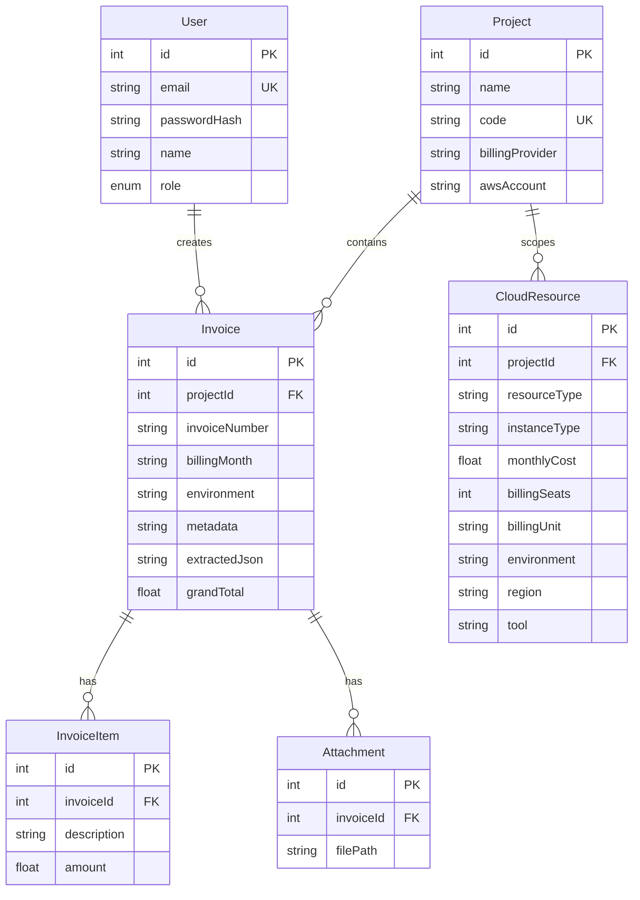

# Database Schema

PostgreSQL database managed by **Prisma** (`backend/prisma/schema.prisma`). Phase 1 uses **six tables** — audit, notification, report, and settings tables were removed from the schema.

---

## Entity relationship diagram



---

## Tables

### `User`

Authentication and ownership.

| Column | Type | Notes |
|--------|------|-------|
| `id` | Int | Primary key |
| `email` | String | Unique |
| `passwordHash` | String | bcrypt |
| `name` | String | Display name |
| `role` | `Role` | `ADMIN`, `FINANCE_MANAGER`, `EMPLOYEE`, `AUDITOR` |
| `createdAt` / `updatedAt` | DateTime | Audit timestamps |

---

### `Project`

Workspace boundary for invoices, infrastructure inventory, and billing views.

| Column | Type | Notes |
|--------|------|-------|
| `id` | Int | Primary key |
| `name` | String | Display name |
| `code` | String | Unique slug (auto-generated from name) |
| `description` | String? | Optional |
| `owner` | String | Owner / PM name |
| `businessUnit` | String? | |
| `status` | String | Default `ACTIVE` |
| `costCenter` | String? | |
| `tags` | String? | JSON or comma-separated |
| `billingProvider` | String | Primary tool label (AWS, Jira, …) |
| `awsAccount` | String? | Account ID when applicable |

**Relations:** `resources[]`, `invoices[]`

---

### `CloudResource`

Infrastructure and SaaS subscription nodes scoped to a project.

| Column | Type | Notes |
|--------|------|-------|
| `id` | Int | Primary key |
| `projectId` | Int | FK → `Project` (cascade delete) |
| `instanceName` | String | Resource display name |
| `resourceType` | String | Service type (e.g. `EC2`, `Copilot Business`, `User License`) |
| `instanceType` | String? | Instance class, DB class, or **plan/tier** for generic SaaS |
| `vcpus` | Int | Default `0` — compute only |
| `memory` | Float | GB — compute/serverless |
| `storage` | Float | GB — storage services & SaaS storage billing |
| `monthlyCost` | Float | Expected monthly spend (USD) |
| `billingSeats` | Int? | Billed users/agents/seats (SaaS seat model) |
| `billingUnit` | String? | `users`, `agents`, or `seats` |
| `environment` | String | Default `Production` — resource-level env tag |
| `region` | String | Cloud region; SaaS subscriptions use `global` |
| `tool` | String | Provider (AWS, Jira, GitHub Copilot, …) |
| `status` | String | e.g. `RUNNING` |
| `publicIp` | String? | Optional — compute profile |
| `availabilityZone`, `privateIp`, `os`, `monitoring`, `tags` | various | Optional metadata |

**Form profile rules** (see [specs/08_dynamic_resource_forms_and_pricing.md](specs/08_dynamic_resource_forms_and_pricing.md)):

- Compute/database rows populate `instanceType`, `vcpus`, `memory`, `storage`.
- Seat-based SaaS populates `billingSeats` + `billingUnit`; `instanceType` empty when product name is in `resourceType`.
- Usage-based SaaS (GitHub Actions, Jira Automation) stores cost only.
- Storage-based SaaS (GitHub Packages, Jira Storage Add-on) uses `storage` + cost.

---

### `Invoice`

Parsed vendor bill linked to a project.

| Column | Type | Notes |
|--------|------|-------|
| `id` | Int | Primary key |
| `projectId` | Int? | FK → `Project` |
| `invoiceNumber` | String | Duplicate check on upload |
| `invoiceDate` | DateTime? | |
| `vendorName` | String? | |
| `currency` | String | Default `USD` |
| `subtotal`, `discount`, `tax`, `shipping`, `grandTotal` | Float | Totals |
| `billingPeriod` | String? | Raw period text from PDF |
| `billingMonth` | String? | Normalized month key (e.g. `Jun-26`) for grids |
| `environment` | String? | Optional env tag when project uses env split |
| `awsAccount` | String? | |
| `status` | `InvoiceStatus` | Lifecycle state |
| `aiConfidenceScore` | Float | OCR confidence |
| `originalFilePath` | String? | Upload path |
| `extractedJson` | String? | Raw parser output JSON |
| `editedJson` | String? | User-edited snapshot |
| `metadata` | String? | **Primary breakdown store** — see below |
| `currentVersion` | Int | Edit version |
| `creatorId` | Int? | FK → `User` |

#### `Invoice.metadata` JSON (common keys)

| Key | Purpose |
|-----|---------|
| `details` | Vendor address, GST, customer fields (enriched at read time) |
| `subscriptionLines` | SaaS seat breakdown: `{ product, seatCount, billingUnit, amount }[]` |
| `billingColumns` / `columnLabels` | Optional hints for billing view column labels |
| `node1Charges`, `node1Cdp`, … | E2E resource-matrix costs |
| `fxInrPerUsd` | Exchange rate metadata — **not** a billable cost column |

Parser output is merged with currency enrichment in `currencyUtils.enrichMetadataWithTotals()`. FX and currency metadata keys are excluded from billing grids via `isBillableMetadataKey()` in `billingViewService.ts`.

---

### `InvoiceItem`

Line items extracted from invoices.

| Column | Type | Notes |
|--------|------|-------|
| `id` | Int | Primary key |
| `invoiceId` | Int | FK → `Invoice` |
| `description` | String | Becomes billing view column label in `multi_product` layout |
| `quantity` | Float | |
| `unitPrice` | Float | |
| `amount` | Float | |

Jira/SaaS parsers may also populate items from `subscriptionLines` via `subscriptionLinesToInvoiceItems()`.

---

### `Attachment`

Uploaded file reference per invoice.

| Column | Type | Notes |
|--------|------|-------|
| `id` | Int | Primary key |
| `invoiceId` | Int | FK → `Invoice` |
| `filePath` | String | Server path |
| `fileType` | String | MIME type |
| `fileSize` | Int | Bytes |
| `createdAt` | DateTime | |

---

## Enums

### `Role`
`ADMIN` | `FINANCE_MANAGER` | `EMPLOYEE` | `AUDITOR`

### `InvoiceStatus`
`DRAFT` | `PENDING_REVIEW` | `APPROVED` | `REJECTED` | `PAID` | `UNPAID` | `SCANNED` | `SAVED`

Billable dashboard totals include: `SAVED`, `SCANNED`, `PENDING_REVIEW`, `APPROVED`, `PAID`, `UNPAID`.  
Excluded: `DRAFT`, `REJECTED`.

---

---

## Migrations & seed

```bash
cd backend
npx prisma generate
npx prisma db push          # apply schema to PostgreSQL
npx prisma db seed          # demo users + sample data
```

| Script | Purpose |
|--------|---------|
| `backend/prisma/seed.ts` | Demo users and sample projects |

**Connection:** set `DATABASE_URL` in `backend/.env` (Supabase pooler recommended for serverless).

---

## Related docs

- [ARCHITECTURE.md](ARCHITECTURE.md) — API and service map
- [specs/07_enterprise_projects_management.md](specs/07_enterprise_projects_management.md) — workspace features
- [specs/09_dynamic_billing_view.md](specs/09_dynamic_billing_view.md) — how metadata drives billing columns
