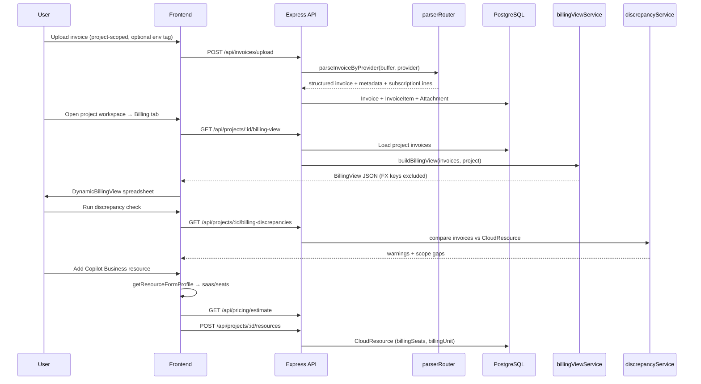

# Architecture Overview Specification

High-level workflow for document ingestion, AI extraction, project-scoped storage, infrastructure inventory, and dynamic billing analytics.

---

## End-to-end workflow

---

## 1. Ingestion (file upload)

- **UI:** `ProjectWorkspace.tsx` (Invoices tab) and `InvoiceList.tsx`
- **API:** `POST /api/invoices/upload` in `invoiceController.ts`
- Files sent as `multipart/form-data`; stored under `backend/uploads/`.
- Upload includes `projectId`; optional `environment` when project uses env split.
- Parser selected from project billing provider / upload context.

---

## 2. Parser routing & OCR

- **Router:** `backend/src/services/parserRouter.ts`
- Provider selection:
  - **E2E Cloud** → `e2eOcrService.ts` (INR/USD totals, node breakdown, billing month)
  - **Jira** → `jiraOcrService.ts` (`subscriptionLines`: product, seatCount, billingUnit, amount)
  - **Default** → `ocrService.ts` (Gemini / GCP / Textract / pdf-parse)

- Duplicate protection: existing `invoiceNumber` returns `409 Conflict`.
- Rich vendor fields stored in `Invoice.metadata` JSON; core totals on `Invoice` columns.
- Jira subscription lines also mapped to `InvoiceItem` rows via `subscriptionLinesToInvoiceItems()`.

---

## 3. Verification workspace

- **UI:** `frontend/src/pages/InvoiceDetail.tsx`
- Side-by-side PDF preview and editable extracted fields.
- **Subscription invoices:** seat/agent summary cards when `metadata.subscriptionLines` exists.
- Status workflow: `DRAFT` → `PENDING_REVIEW` → `APPROVED` / `REJECTED` / `PAID`.
- Edits persisted to `Invoice` and optional `editedJson`.

---

## 4. Database persistence

- **ORM:** Prisma → PostgreSQL (`backend/prisma/schema.prisma`)
- **Tables:** `User`, `Project`, `CloudResource`, `Invoice`, `InvoiceItem`, `Attachment`
- Full schema: [DATABASE.md](../DATABASE.md)

Removed in schema simplification:
- `Notification`, `ActivityLog`, `Report`, `ProjectBilling`, `Setting`

---

## 5. Project workspace

- **List:** `frontend/src/pages/Projects.tsx`
- **Detail:** `frontend/src/pages/ProjectWorkspace.tsx` — four tabs:

| Tab | Function |
|-----|----------|
| Overview | Project metadata, spend summary cards |
| Infrastructure | `CloudResource` CRUD with dynamic form profiles |
| Invoices | Project-scoped invoice table + upload |
| Billing | `DynamicBillingView` + discrepancy panel |

**Environment UX:** upload/filter/column controls appear only when invoices use **2+ distinct environment tags** (`environmentUtils.ts`).

Project creation auto-generates unique `code` from name. Environment and region are **resource-level** (SaaS uses `region = global`).

---

## 6. Infrastructure & pricing

- **Resource types:** `frontend/src/constants/resourceTypes.ts`
- **Form profiles:** compute, database, storage, serverless, usage, saas, container, generic
- **SaaS billing models:** `seats` | `usage` | `storage` per catalog entry
- **Pricing API:** `GET /api/pricing/estimate` → `pricingService.ts`

See [08_dynamic_resource_forms_and_pricing.md](./08_dynamic_resource_forms_and_pricing.md).

---

## 7. Dynamic billing analytics

- **Service:** `backend/src/services/billingViewService.ts`
- **API:** `GET /api/projects/:id/billing-view`
- **UI:** `frontend/src/components/DynamicBillingView.tsx`

### Layout detection (data-driven)

| Layout | Trigger |
|--------|---------|
| `resource_matrix` | Node/charge keys in metadata |
| `multi_product` | Multiple invoice line-item descriptions |
| `category_matrix` | Multiple numeric metadata cost fields |
| `monthly_summary` | Default single-total-per-month |

**Excluded from cost columns:** FX keys (`fxInrPerUsd`), currency metadata, non-billable keys (`isBillableMetadataKey`).

---

## 8. Dashboard & ledger

### Executive Ledger (`Dashboard.tsx`)

- **API:** `GET /api/invoices/dashboard-stats`
- KPI cards, monthly chart, vendor chart, **month × project matrix**
- Optional environment filter when `distinctInvoiceEnvironments.length > 1`

### Billing ledger

- **UI:** `InvoiceList.tsx`

---

## 9. Navigation (Phase 1)

Active routes: `/dashboard`, `/projects`, `/projects/:id`, `/invoices`, `/invoices/:id`.

**Removed from router:** `/reports`, `/settings`. See [FEATURES.md](../FEATURES.md).

---

## Code map (primary files)

| Concern | Location |
|---------|----------|
| Express entry | `backend/src/index.ts` |
| Prisma schema | `backend/prisma/schema.prisma` |
| Invoice upload | `backend/src/controllers/invoiceController.ts` |
| Projects | `backend/src/controllers/projectsController.ts` |
| Billing view | `backend/src/services/billingViewService.ts` |
| Discrepancy | `backend/src/services/discrepancyService.ts` |
| Pricing | `backend/src/services/pricingService.ts` |
| App routes | `frontend/src/App.tsx` |
| Resource profiles | `frontend/src/constants/resourceTypes.ts` |
| Project workspace | `frontend/src/pages/ProjectWorkspace.tsx` |
